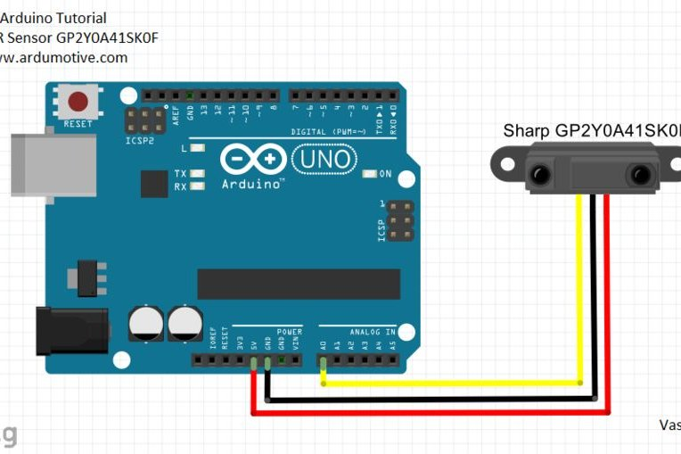

# Sharp IR - MediaPlayer
Media player handler using SharpIR sensor

## Description
The goal of this project is to interact with media players and allow the user to perform some actions with as less effort as possible, using a Sharp IR distance sensor.

At the moment we are working with two models of this sensor:
- **GP2Y0A21YK0F** (5cm to 80cm)
- **GP2Y0A02YK0F** (20cm to 150cm)

## Get it running
Connect the sensor to your Arduino board in this manner:

| Wire   | Pin |
|--------|:---:|
| Red    | +5v |
| Black  | GND |
| Yellow | A0  |

## Common issues and how to solve them

### Distance is not accurate
Check that the sensor you are using is the same as the one specified at the beginning of the sketch. Depending on the sensor model you are using, you should change from MODEL0 to MODEL1 or viceversa. Update this change to Arduino and this should be fixed.

### The port is not working
By default the port will be set as the same as last time we used it. Simply go to "*Tools > Port > select usb*" to fix this and try to upload your sketch again.

### Library does not work
Two things can happen in this case:
- The library is recently installed: try closing and opening Arduino IDE. It might be that the new library is not being recognized by the system, so resetting the IDE should fix this.
- The library is not included: make sure you have imported the necessary libraries at the beginning of the file (#include <*Library*.h>)
- The library is already include but the console says otherwise: in this case it can be that the library is ont compatible with the Arduino board. Then you are fucked :)