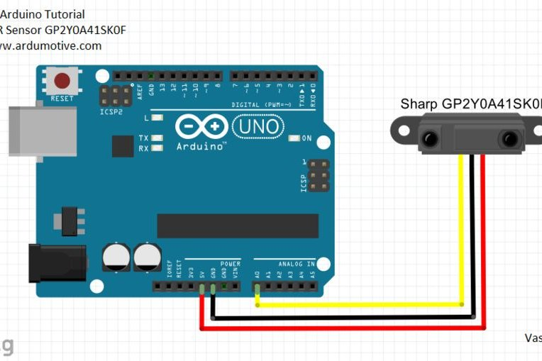

# SHARP IR

- Youtube handler using SharpIR sensor

## DESCRIPTION

The goal of this project is to create a new way to interact with the computer using Arduino as the required Tool. The tasks to be completed are split into two different sections:

- Interact with **Youtube** to allow the user to perform some actions (start/pause | next/previous video | Volume up/down) with as less effort as possible and not requiring the hands in the process (handless)

At the moment we are working with two models of this sensor:

- **GP2Y0A21YK0F** (5cm to 80cm) name as MODEL0 in the code
- **GP2Y0A02YK0F** (20cm to 150cm) name as MODEL1 in the code

We suggest using MODEL0 in order to get more reliable behaviour.

## RANGES

The range used by the sensor (5 cm to 80 cm or 20 cm to 150 cm depending on the model) is split into 7 areas. These areas are the ones which decide which action is to be used. The ranges are:

- **MODEL0**

  - RANGE0 = 5 cm;
  - RANGE1 = 15 cm;
  - RANGE2 = 25 cm;
  - RANGE3 = 35 cm;
  - RANGE4 = 45 cm;
  - RANGE5 = 55 cm;
  - RANGE6 = 65 cm;

- **MODEL1**
  - RANGE0 = 20 cm;
  - RANGE1 = 30 cm;
  - RANGE2 = 40 cm;
  - RANGE3 = 50 cm;
  - RANGE4 = 60 cm;
  - RANGE5 = 70 cm;
  - RANGE6 = 80 cm;

## ACTIONS

The actions, as it happened with the ranges, are defined by the type of sensor used. Nevertheless, on this case, they work depending on the sections (Combination of ranges).

**Place hand**

- Between RANGE0 and RANGE 2 -> Previous video
- Between RANGE2 and RANGE4 -> Start/Stop the video
- Between RANGE4 and RANGE 6 -> Next video

| ACTION LED |       Pin        |
| ---------- | :--------------: |
| Red        |  Previous video  |
| Yellow     | Start/Stop video |
| Green      |    Next video    |

**Swipe action:**

- From RANGE6 to RANGE0 -> Volume down
- From RANGE0 to RANGE6 -> Volume up

On this actions the LEDs will be light up sequentialy

| ACTION LED           |     Pin     |
| -------------------- | :---------: |
| Red + Yellow + Green |  Volume Up  |
| Green + Yellow + Red | Volume Down |

## Get it running

On this section the materials which are required are mentioned:

### ARDUINO LEONARDO

The Arduino used on this project is Arduino Leonardo. It is important to mention that Arduino UNO does not fit on it since it can not use <Keyboard.h> library

### SENSOR

Connect the sensor to your Arduino board in this manner:

| Wire   | Pin |
| ------ | :-: |
| Red    | +5v |
| Black  | GND |
| Yellow | A0  |

### BREADBOARD/PROTOBOARD

On the breadboard just the 5 LED are connected:

- 3 LED to show the action which has been carried out
- 2 LED to show which

To accomplish this circuit it is mandatory to connect the GND pin to the 'short leg' of the LED and the long one to the PIN which requires it:

| ACTION LED | Pin |
| ---------- | :-: |
| Red        | 13  |
| Yellow     |  8  |
| Green      |  4  |

## COMMON ISSUES AND HOW TO SOLVE THEM

### DISTANCE IS NOT ACCURATE

Check that the sensor you are using is the same as the one specified at the beginning of the sketch. Depending on the sensor model you are using, you should change from MODEL0 to MODEL1 or vice-versa. Update this change to Arduino and this should be fixed.

### THE PORT IS NOT WORKING

- By default the port will be set as the same as last time we used it. Simply go to "_Tools > Port > select usb_" to fix this and try to upload your sketch again.
- Another fact to mentioned is that Arduino Leonardo is connected using the MicroUSB as it is shown on the picture above

### LIBRARY DOES NOT WORK

- Check if the library is actually installed in your Arduino IDE (tools>include library>manage library)
- The library is recently installed: try closing and opening Arduino IDE. It might be that the new library is not being recognized by the system, so resetting the IDE should fix this.
- The library is not included: make sure you have imported the necessary libraries at the beginning of the file (#include <_Library_.h>)
- Keyboard library is meant to be used on the Arduino Leonardo as it is mentioned on Arduino Leonardo section
